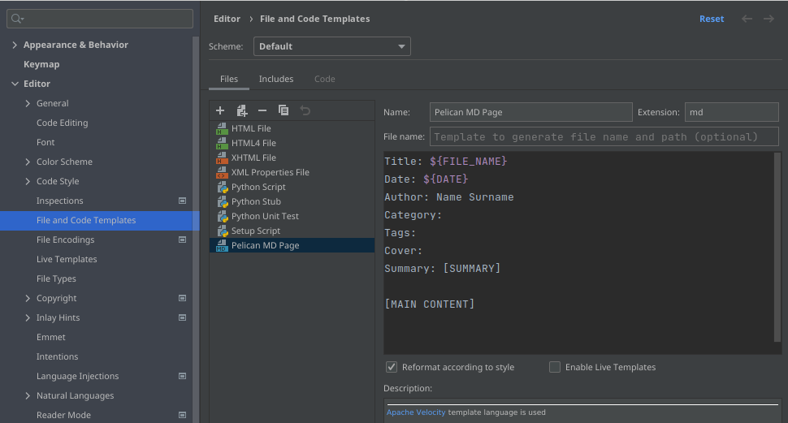
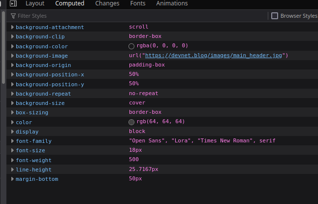
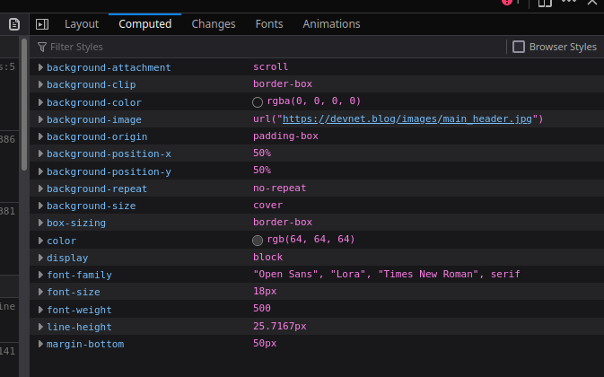

# DevNet Blog

---

### **http://devnet.blog/**

Here you will find information in regards to configuration, deployment, styling.

### Links

- https://docs.getpelican.com/en/latest/ - Pelican documentation
- https://github.com/arulrajnet/attila - Documentation for used 
- https://github.com/peaceiris/actions-gh-pages - GitHub Action for deploying static website

## Theme

---

### CSS

- `post-meta` - Tag's class used for post's footer, which includes Author, Date.


### TODO


## DNS and URL

---

### Verification

```commandline
dig devnet.blog +noall +answer -t A
```


## Workflows

---

### Build and deploy

Generating website and its deployment to desire branch is done through GitHub Actions. File is placed in `.github/workflows/build.yml`


## Articles

---

### How to

Each article has to be placed in `content/articles/` directory as an `*.md` file type.

Its structure:

> **Title**: Required; Main header of the article.  
> **Date**: Required; Data of posting.  
> **Author**: Required; One of the `Name Surname` defined authors.  
> **Category**: Optional; By default, it gets an `General` Category.  
> **Tags**: Optional  
> **Cover**: Optional; Path to header image. If not provided, default one will be used.  
> **Summary**: Required. Short description of the article.    
>  
> [MAIN CONTENT] 
> Article's content written in Markdown.

### PyCharm File Template

To help ourself, [`PyCharm's File Template`]( https://www.jetbrains.com/help/pycharm/using-file-and-code-templates.html) definition below.    
_Settings -> Editor -> File and Code Templates_ 

 

Template to Copy/Paste
```
Title: ${FILE_NAME}  
Date: ${DATE}  
Author: Name Surname
Category: 
Tags: 
Cover: 
Summary: [SUMMARY]

[MAIN CONTENT]
```


### Logo's height issue
Main page/index




